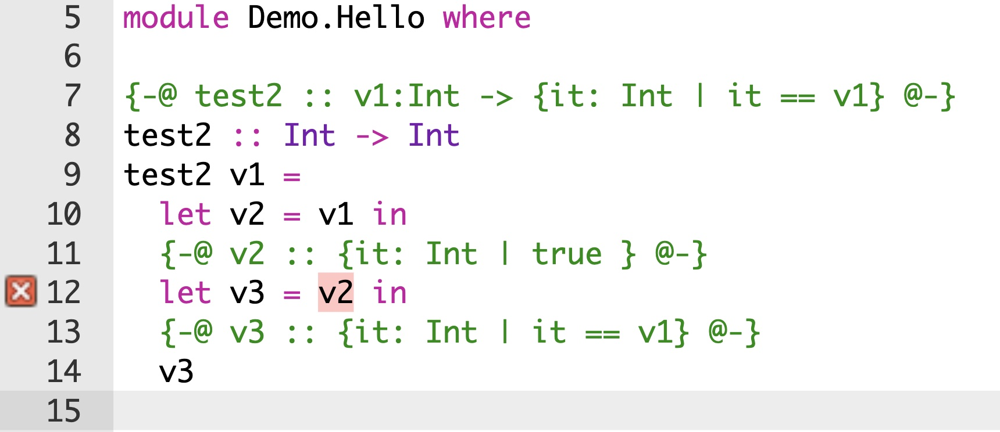

## Introduction

I am [Matt Bovel](mailto:matthieu@bovel.net) ([@mbovel](https://github.com/mbovel)).

<div class="fragment">

A PhD student at EPFL in Switzerland, between two labs:

- [LAMP](https://www.epfl.ch/labs/lamp/): led by Martin Odersky, making the [Scala compiler](https://github.com/scala/scala3/),
- [LARA](https://lara.epfl.ch/w/): led by Viktor Kunčak, making the [Stainless verifier](https://github.com/epfl-lara/stainless).

</div>

<div class="fragment">

Work done in collaboration with Quentin Bernet and Valentin Schneeberger.

</div>

<div class="notes">

I am Matt Bovel, a PhD student at EPFL in Switzerland, between two labs: LAMP, led by Martin Odersky, making the Scala compiler that you probably know, and LARA, led by Viktor Kunčak, making the Stainless verifier—a tool to prove properties of Scala programs. It is not integrated in the compiler. My job is to bring verification capabilities directly into the Scala compiler.

What I present today has been done in collaboration with Quentin Bernet, who designed syntax and runtime checks for qualified types in his master's thesis, and Valentin Schneeberger, who worked on runtime checks in his bachelor's thesis.

</div>

## Motivating example: Safe list zip

<div class="columns">
<div class="column">

Consider the standard `zip` function:

```scala
def zip[A, B](
  as: List[A],
  bs: List[B]
): List[(A, B)] =
  ...
```

<div class="fragment">

Ideal timing: 00:45

How can we specify this function to require both lists to have the same size, and return a list of that size?

</div>

</div>
<div class="column">

<figure style="text-align: right">

<figcaption>Black leather zip up jacket, by [Todd Pham](https://unsplash.com/photos/black-leather-zip-up-jacket-IWskws9WvAs)</figcaption>
</figure>

</div> <!-- .column -->

</div> <!-- .columns -->

<div class="notes">

In the Scala standard library, the result is truncated to the shorter list.

But what if we want to ensure they have the same size before zipping?

</div>

## Specify using assertions 😕

<div class="columns">
<div class="column">

We can use assertions:

```scala
def zip[A, B](
  as: List[A],
  bs: List[B]
) : List[(A, B)] = {
  require(as.size == bs.size)
  ...
}.ensure(_.size == as.size)
```

</div>
<div class="column fragment">

Limitations:

- _Runtime overhead_: checked at runtime, not compile time,
- _No static guarantees_: only checked for specific inputs,
- _Not part of the API_: not visible in function type,
- _Hard to compose_: cannot be passed as type argument.

</div> <!-- .column -->

</div> <!-- .columns -->

<div class="notes">

Ideal timing: 01:30

We can use assertions, but they have limitations. The check happens at runtime, so there's overhead. The compiler can't verify the precondition is always satisfied. The precondition is not visible in the function type. And assertions don't compose well—imagine passing a list of values that all satisfy some property.

</div>

## Specify using dependent types 😕

<div class="columns">
<div class="column">

Can we use path-dependent types?

```scala
def zip[A, B](
  as: List[A],
  bs: List[B] {
    val size: as.size.type
  }
): List[(A, B)] {
  val size: as.size.type
} = ...
```

</div>
<div class="column fragment">

Limitations:

- _Limited reasoning_: only fields, literals and constant folding,
- _Not inferred_: need manual type annotations, or not typable at all,
- _Different languages_: term-level vs type-level.

</div> <!-- .column -->

</div> <!-- .columns -->

<div class="notes">

Ideal timing: 02:15

</div>

## Specify using logically qualified types ! 🤩

Introducing logically qualified types:

```scala
def zip[A, B](
  as: List[A],
  bs: List[B] with bs.size == as.size
): {l: List[(A, B)] with l.size == as.size} = ...
```

<div class="fragment">

The return type means<br/>
“any value `l` of type `List[(A, B)]` such that `l.size == as.size`”.

</div>

<div class="notes">

Ideal timing: 03:00

</div>

## In other languages

<div class="columns">
<div class="column">

- ["Refinement types for ML" (Freeman & Pfenning, 1991)](https://dl.acm.org/doi/10.1145/113446.113468)
- [“Liquid Types” (Rondon, Kawaguchi & Jhala, 2008)](https://dl.acm.org/doi/10.1145/1375581.1375604)
- [“Refinement Types for Haskell” (Vazou, Seidel, Jhala, Vytiniotis, Peyton-Jones, 2014)](https://dl.acm.org/doi/10.1145/2628136.2628161)
- [Liquid Haskell](https://ucsd-progsys.github.io/liquidhaskell/)
- [Boolean refinement types in F\*](https://fstar-lang.org/tutorial/book/part1/part1_getting_off_the_ground.html#boolean-refinement-types)
- [Subset types in Dafny](https://dafny.org/latest/DafnyRef/DafnyRef#sec-subset-types)
- [Subtypes in Lean](https://lean-lang.org/doc/reference/latest/Basic-Types/Subtypes/)

</div>
<div class="column">

<div class="fragment">

In Scala:

- [“SMT-based checking of predicate-qualified types for Scala”, (Schmid & Kunčak, 2016)](https://dl.acm.org/doi/10.1145/2998392.2998398)
- [Refined library, Frank Thomas](https://github.com/fthomas)
- [Iron library, Raphaël Fromentin](https://github.com/Iltotore/iron)

</div> <!--- .fragment -->
</div> <!-- .column -->
</div> <!-- .columns -->

<div class="notes">

Ideal timing: 04:00

</div>

## Main difference with Liquid Haskell

Liquid Haskell is a plugin that runs after type checking.

<figure>

<figcaption>Screenshot from the [Liquid Haskell Demo](https://liquidhaskell.goto.ucsd.edu/index.html)</figcaption>
</figure>

<div class="fragment">

In contrast, we integrate qualified types directly into the Scala type system and compiler.

</div>

<div class="notes">

Ideal timing: 04:30

</div>

## Syntax

```scala
type NonEmptyList[A] = { l: List[A] with l.nonEmpty }
```

- `l`: binder
- `List[A]`: parent type
- `l.nonEmpty`: qualifier (predicate)

<div class="fragment">

Not to be confused with Scala's existing structural refinement types:

```scala
case class Box(value: Any)
type IntBox = Box { val value: Int }
```

</div>

<div class="notes">

Ideal timing: 05:00

A qualified type defines a subset of values. Here `l` is a binder, `List[A]` is the parent type, and `l.nonEmpty` is the predicate or qualifier. This reads "all List[A] values l such that l is non-empty". We call them logically qualified types in Scala to distinguish from structural refinement types, which refine members like `val` and `def`.

</div>

## Shorthand syntax

When a binder already exists, such as in:

```scala
def zip[A, B](as: List[A], bs: {bs: List[B] with bs.size == as.size})
```

<div class="fragment">

We can omit it:

```scala
def zip[A, B](as: List[A], bs: List[B] with bs.size == as.size)
```

</div>

<div class="fragment">

The second version is desugared to the first.

</div>

<div class="notes">

Ideal timing: 05:30

When the value already has a name, like a parameter or val, you can skip the binder. The name is reused in the predicate.

</div>

## More list API examples 🥳

```scala
def zip[A, B](as: List[A], bs: List[B] with bs.size == as.size):
  {l: List[(A, B)] with l.size == as.size}
```

```scala {.fragment}
def concat[T](as: List[T], bs: List[T]):
  {rs: List[T] with rs.size == as.size + bs.size}
```

```scala {.fragment}
val xs: List[Int] = ...
val ys: List[Int] = ...
zip(concat(xs, ys), concat(ys, xs))
zip(concat(xs, ys), concat(xs, xs)) // error
```

<div class="notes">

Ideal timing: 06:15

</div>

## What are valid predicates?

<div class="fragment">

```scala
var x = 3
val y: Int with y == 3 = x // ⛔️ x is mutable
```

</div>

<div class="fragment">

```scala
class Box(val value: Int)
val b: Box with b == Box(3) = Box(3) // ⛔️ Box has equality by reference
```

</div>

<div class="fragment">

The predicate language is restricted to a fragment of Scala consisting of constants, stable identifiers, field selections over `val` fields, pure term applications, type applications, and constructors of case classes without initializers.

</div>

<div class="fragment">

Purity of functions is currently not enforced. Should it be?

</div>

<div class="notes">

Ideal timing: 07:15

</div>

## How to introduce qualified types?

For backward compatibility and performance reasons, qualified types are not inferred from terms by default. The wider type is inferred instead:

```scala
val x: Int = readInt()
val y /* : Int */ = x + 1
```

<div class="notes">

Ideal timing: 08:00

</div>

## Selfification

However, when a qualified type is expected, the compiler attempts to _selfify_ the typed expression: that
is, to give `e: T` the qualified type `x: T with x == e`:

```scala
val x: Int = readInt()
val y: Int with (y == x + 1) = x + 1
```

<div class="fragment">

```scala
def f(i: Int): Int = i * 2
val z: Int with (z == x + f(x)) = x + f(x)
```

</div>

<div class="notes">

Ideal timing: 08:30

</div>

## Runtime checks

When static checking fails, a qualified type can be checked at runtime using pattern matching:

```scala
val idRegex = "^[a-zA-Z_][a-zA-Z0-9_]*$"
type ID = {s: String with s.matches(idRegex)}
```

<div class="fragment">

```scala
"a2e7-e89b" match
    case id: ID => // matched: `id` matches idRegex
    case id     => // didn't match
```

</div>

<div class="notes">

Ideal timing: 09:15

When the compiler can't verify a predicate statically, you can use runtime checks. Pattern matching checks the predicate at runtime.

</div>

## Runtime checks: `.runtimeChecked`

You can also use `.runtimeChecked` ([SIP-57](https://docs.scala-lang.org/sips/replace-nonsensical-unchecked-annotation.html)) when the check must always pass:

```scala
val id: ID = "a2e7-e89b".runtimeChecked
```

<div class="fragment">

Desugars to:

```scala
val id: ID =
  if ("a2e7-e89b".matches(idRegex)) "a2e7-e89b".asInstanceOf[ID]
  else throw new IllegalArgumentException()
```

</div>

<div class="fragment" style="font-size: 0.8em;">

Note: like with other types, you can also use `.asInstanceOf[ID]` directly to skip the check altogether.

</div>

<div class="notes">

Ideal timing: 10:00

</div>

## Runtime checks: `List.collect`

Scala type parameters are _erased_ at runtime, so we cannot match on a `List[T]`.

<div class="fragment">

However, we can use `.collect` to filter and convert a list:

```scala
type Pos = { v: Int with v >= 0 }

val xs = List(-1,2,-2,1)
xs.collect { case x: Pos => x } : List[Pos]
```

</div>

## Subtyping

How does the compiler check `{x: T with p(x)} <: {y: S with q(y)}`?

1. Check `T <: S`
2. Check `p(x)` implies `q(x)` for all `x`

<div class="fragment">

A solver is needed to check logical implication (2.).

</div>

<div class="fragment">

We developed a lightweight custom solver that combines several techniques:

- constant folding,
- normalization,
- unfolding,
- and equality reasoning.

</div>

<div class="notes">

Ideal timing: 17:00

To check if one qualified type is a subtype of another, the compiler checks if the parent types are related, and if the first predicate implies the second. Our implementation uses a lightweight custom solver that combines several techniques.

</div>

## Subtyping: constant folding

```scala
{v: Int with v == 1 + 1}     <: {v: Int with v == 2}
```

## Subtyping: normalization

Arithmetic expressions are normalized using standard algebraic properties, for example commutativity of addition:

```scala
{v: Int with v == x + 1}     <: {v: Int with v == 1 + x}
```

<div class="fragment">

```scala
{v: Int with v == y + x}     <: {v: Int with v == x + y}
```

</div>

<div class="fragment">

Or factorization:

```scala
{v: Int with v == x + 3 * y} <: {v: Int with v == 2 * y + (x + y)}
```

</div>

## Subtyping: unfolding

Remember: qualified types are not inferred from terms by default. However, the solver can unfold definitions of local `val` (only), even when they have an imprecise type:

```scala
val x: Int = ...
val y: Int = x + 1

{v: Int with v == y} =:= {v: Int with v == x + 1}
```

## Subtyping: equality reasoning

Transitivity of equality:

```scala
{v: Int with v == a && a == b} <: {v: Int with v == b}
```

<div class="fragment">

Congruence of equality:

```scala
{v: Int with a == b}           <: {v: Int with f(a) == f(b)}
```

</div>

<div class="fragment">

This is implemented using an E-Graph-like data structure.

</div>

## Subtyping with other Scala types

Singleton qualified types are subtypes of literal types:

```scala
{v: Int with v == 3} <: 3
```

<div class="fragment">

We plan to support subtyping with other Scala types in the future.

</div>

## Future work: SIP

Some work remains on UX (error messages, IDE support, documentation).

<div class="fragment">

Then we'll make a pre-SIP to get feedback from the community.

</div>

<div class="fragment">

Then a full SIP to standardize qualified types in Scala! 🚀

</div>

## Future work: term-parameterized types

```scala
extension [T](list: List[T])
  def get(index: Int with index >= 0 && index < list.size): T = ...
```

<div class="fragment">

To modularize the “range” concept, we could introduce term-parameterized types:

```scala
type Range(from: Int, to: Int) = {v: Int with v >= from && v < to}
extension [T](list: List[T])
  def get(index: Range(0, list.size)): T = ...
```

</div>

## Future work: flow-sensitive typing

Works with pattern matching:

```scala
x match
  case x: Int with x > 0 =>
    x: {v: Int with v > 0}
```

<div class="fragment">

Could also work with `if` conditions:

```scala
if x > 0 then
  x: {v: Int with v > 0}
```

</div>

## Future work: flow-sensitive typing

Crucially, this would be required for "GADT-like" reasoning with qualified types:

<div style="font-size: 0.7em;">

```scala
enum MyList[+T]:
  case Cons(head: T, tail: MyList[T])
  case Nil

def myLength(xs: MyList[Int]): Int =
  xs match
    case MyList.Nil =>
      // Add assumption xs == MyList.Nil
      0
    case MyList.Cons(_, xs1) =>
      // Add assumption xs == MyList.Cons(?, xs1)
      1 + myLength(xs1)
```

</div>

## Future work: integration with SMT solvers

Our solver is lightweight 👍 but incomplete 👎.

<div class="fragment">

In particular, it cannot handle ordering relations yet, for example it cannot prove:

```scala
{v: Int with v > 2} <: {v: Int with v > 0}
```

</div>

<div class="fragment">

For this and for more complex predicates, we could integrate with an external SMT solver like [Z3](https://microsoft.github.io/z3guide/docs/logic/intro/), [CVC5](https://cvc5.github.io/), or [Princess](https://philipp.ruemmer.org/princess.shtml) _for casting only_, so that we don't pay the potential performance cost everywhere.

</div>

## Conclusion

<div class="columns">

<div class="column" style="flex: 2;">

- Syntax: `{x: T with p(x)}`,
- Selfification: `e: T` becomes `x: T with x == e` when needed,
- Runtime checks: pattern matching and `.runtimeChecked`,
- Subtyping: custom lightweight solver,
- Future work: SIP, term-parameterized types, flow-sensitive typing, SMT integration.

---

- [Two-page summary](./talk_proposal.pdf)
- [Prototype (dotty#21586)](https://github.com/scala/scala3/pull/21586)

</div>

<div class="column">

<figure style="text-align: center">

<figcaption><em>Un type qualifié</em>, by Marina Granados Castro</figcaption>
</figure>

</div> <!-- .column -->
</div> <!-- .columns -->

## Backup/outdated slides

## Bonus: works with implicit resolution

<div style="font-size: 0.7em;">

```scala
type Pos = { v: Int with v >= 0 }
type Neg = { v: Int with v < 0 }

trait Show[-A]:
  def apply(a: A): String
given show1: Show[Pos] with
  def apply(a: Pos): String = "I am a positive integer!"
given show2: Show[Neg] with
  def apply(a: Neg): String = "I am a negative integer!"
def show[A](a: A)(using s: Show[A]): String = s.apply(a)

def f(x: Int with x == 42, y: Int with y == -42): Unit =
  println(show(x)) // I am a positive integer!
  println(show(y)) // I am a negative integer!
```

</div>

## Checking integer equality at the type level

```scala
def checkSame(dimA: Int, dimB: dimA.type): Unit = ()
checkSame(3, 3) // ok
checkSame(3, 4) // error
```

<div class="notes">

We can use path-dependent types. Here, `dimB` must have type `dimA.type`, meaning it must be the same value as `dimA`. This works for simple cases.

</div>

## Checking integer equality at the type level 🥲

```scala
def checkSame(dimA: Int, dimB: dimA.type): Unit = ()
val x = 3
val y = 3
checkSame(x, y) // error
```

<div class="notes">

But this fails when we assign values to variables. The type of `x` is inferred as `Int`, not `3`, so the types don't match even though the values are equal.

</div>

## Checking integer equality at the type level 😄

```scala
def checkSame(dimA: Int, dimB: dimA.type): Unit = ()
val x: 3 = 3
val y: 3 = 3
checkSame(x, y) // ok
```

<div class="notes">

We can use literal types. Both `x2` and `y3` have type `3`, which is a subtype of `3.type`. But literal types only work for constants and are not inferred by default.

</div>

## Checking integer equality at the type level 😢

```scala
def checkSame(dimA: Int, dimB: dimA.type): Unit = ()
def readInt(): Int = ...
val x: Int = readInt()
val y = x
val z = y
checkSame(y, z) // error
```

<div class="notes">

With runtime values, we can't use literal types. Even though `z` equals `x` and `a` equals `y`, the compiler can't reason symbolically about these equalities by default.

</div>

## Checking integer equality at the type level 😁

```scala
def checkSame(dimA: Int, dimB: dimA.type): Unit = ()
val x: Int = readInt()
val y: x.type = x
val z: x.type = x
checkSame(y, z) // okay
```

<div class="notes">

Path-dependent types let us express symbolic equalities. We can say `z` has type `x.type`, meaning `z` equals `x`. But the types still don't match: `x.type` and `y.type` are different types.

</div>

## Checking integer equality at the type level 😓

```scala
def checkSame(dimA: Int, dimB: dimA.type): Unit = ()
val x: Int = readInt()
val y: Int = readInt()
val z = x + y
val a = y + x
checkSame(z, a) // error
```

<div class="notes">

When we add arithmetic, things break down. We know `x + y` equals `y + x` by commutativity, but the compiler doesn't.

</div>

## Checking integer equality at the type level 😲

```scala
def checkSame(dimA: Int, dimB: dimA.type): Unit = ()
import scala.compiletime.ops.int.+
val x: 3 = 3
val y: 5 = 5
val z: x.type + y.type = x + y
val a: y.type + x.type = y + x
checkSame(z, a) // error
```

## Checking integer equality at the type level 😭

```scala
import scala.compiletime.ops.int.+
val x: Int = readInt()
val y: Int = readInt()
val z: x.type + y.type = x + y // error
val a: y.type + x.type = y + x // error
checkSame(z, a) // error
```

<div class="notes">

Type-level arithmetic exists in Scala, but it only works with literal types, not runtime values. And even if it worked, `x.type + y.type` is not the same type as `y.type + x.type`.

</div>
